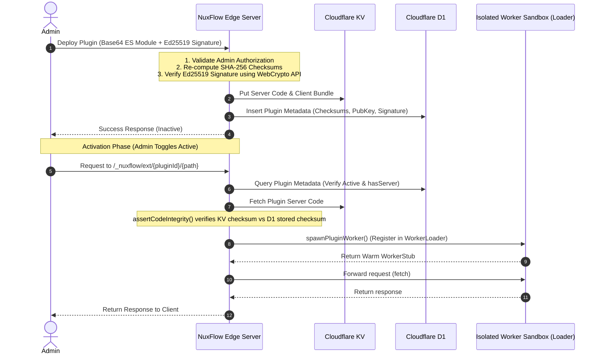

# NuxFlow CMS: Developer & Agent Context Guide (GEMINI.md)

Welcome to the context guide for **NuxFlow**, an open-source, edge-native CMS built on **Nuxt 4** and designed specifically to run on the **Cloudflare Workers edge ecosystem** (with Turso/libSQL fallback). NuxFlow represents a paradigm shift from traditional VPS-hosted CMS platforms like WordPress to the serverless edge, offering high performance, multi-tenancy, and visual editing with zero server configuration.

---

## 1. Project Mission & Philosophy

NuxFlow is designed to bridge the gap between two key target audiences:

- **For Non-Technical Users:** It provides a guided onboarding wizard, a drag-and-drop Canvas page builder (TipTap and Vue blocks), a media library, a multi-step form builder, and an intuitive admin dashboard — all without editing configuration files or database schemas manually.
- **For Developers:** It provides a fully typed Nuxt 4 monorepo with Drizzle ORM, a typed REST + GraphQL API, a theme layer system (using Nuxt layers), and a secure, dynamic plugin runtime.

### Key Differentiators vs. EmDash (Cloudflare's Astro CMS)

- **Framework Preference:** EmDash is React/Astro-based. NuxFlow serves Vue and Nuxt developers who prefer a reactive Vue-native visual editor and cohesive Nuxt ecosystem integrations.
- **Visual-First & Low Friction:** While EmDash focuses on developer-first structured content schemas, NuxFlow replicates a WordPress-like experience where editors can lay out pages visually using **Canvas** without needing developer scaffolding for every page change.

---

## 2. Core Technology Stack

| Layer                | Technology                                                                                 |
| -------------------- | ------------------------------------------------------------------------------------------ |
| **Core Framework**   | Nuxt 4 (utilizing the new `app` directory and server modules)                              |
| **Edge Runtime**     | Cloudflare Workers (compiled via Nitro `cloudflare-module` preset)                         |
| **Database ORM**     | Drizzle ORM (scoped queries, type-safe prepared statements)                                |
| **Database Engines** | Cloudflare D1 (primary edge DB) · Turso/libSQL (development and alternative)               |
| **UI Components**    | Nuxt UI Pro (TipTap `UEditor`, `UDashboardSidebar` and styled widgets)                     |
| **Authentication**   | Better Auth + `@onmax/nuxt-better-auth` integration (Email/Password, Google, GitHub OAuth) |
| **Animations**       | Motion Vue (`motion-v` primitives for transitions)                                         |
| **Multi-Language**   | `@nuxtjs/i18n` with per-item locale mapping                                                |
| **Monorepo**         | pnpm workspaces + Turborepo for workspace orchestration                                    |

---

## 3. Directory Structure & Key Files

```
c:/DEV/NuxFlow/
├── apps/
│   └── nuxflow/                      # Main Nuxt 4 application
│       ├── app/                      # Client-side Nuxt 4 code
│       │   ├── components/           # Editor, form builders, media pickers
│       │   ├── layouts/              # Layout variants (admin, public, setup)
│       │   ├── middleware/           # client-side auth & setup-guard.global.ts
│       │   ├── pages/                # Admin dashboards, setup wizard, client pages
│       │   └── stores/               # Pinia stores (auth, content, site)
│       └── server/                   # Server-side API & Edge middleware
│           ├── api/v1/               # Core REST API endpoints (CRUD, setup, AI)
│           ├── auth.config.ts        # Better Auth edge configuration
│           ├── middleware/           # Auto-migrations, D1-cache, multi-site resolution
│           ├── routes/               # Public XML/TXT feeds (sitemap.xml, robots.txt)
│           ├── scheduled/            # Edge cron tasks (auto-publish schedule)
│           └── utils/                # DB clients, rate-limiters, providers, WebCrypto signing
├── packages/
│   ├── db/                           # Database migration scripts & client definitions
│   │   ├── src/schema/               # Type-safe schemas (content, sites, system, users)
│   │   └── src/client.ts             # LibSQL database client factory
│   ├── plugin-sdk/                   # Types, interfaces, and helpers for plugin authors
│   └── cli/                          # CLI tool for scaffolding plugins and themes
├── themes/
│   └── default/                      # Default theme layer (Nuxt layer with block renderers)
└── packages/plugins/
    ├── canvas/                       # Canvas page builder block system and UI
    ├── contact-form/                 # Contact form plugin (multi-step, conditional logic)
    └── payments/                     # Payments plugin (Stripe, Lemon Squeezy, Paddle integrations)
```

---

## 4. The Dynamic Plugin System (Edge-Sandboxed Extensibility)

One of NuxFlow's crown jewels is its **dynamic plugin execution system** designed for serverless compute limits.

Historically, loading dynamic plugins on serverless edge networks (like Cloudflare Workers) was impossible because the runtime code must be compiled and deployed statically. NuxFlow solves this by integrating **Cloudflare's Dynamic Workers API** (released March 2026), specifically using the `WorkerLoader` binding.



### Signature Verification & Integrity Controls

To prevent arbitrary code execution vulnerabilities, NuxFlow enforces strict cryptographic constraints:

1.  **Ed25519 Publisher Signing:** Every plugin must be signed by the author's private key. The deployment payload contains the SPKI Ed25519 `publisherPublicKey` and an Ed25519 `signature` of the canonical payload (`id + version + serverChecksum + clientChecksum`).
2.  **WebCrypto API Execution:** In [plugin-signing.ts](file:///c:/DEV/NuxFlow/apps/nuxflow/server/utils/plugin-signing.ts), the verification runs entirely on the native **Web Crypto API** (`globalThis.crypto.subtle`), ensuring high-speed validation on Edge compute without heavy external dependencies.
3.  **Assertion Checkpoint:** When a request proxies to a dynamic plugin in [route handler](file:///c:/DEV/NuxFlow/apps/nuxflow/server/routes/_nuxflow/ext/%5BpluginId%5D/%5B...path%5D.ts), `assertCodeIntegrity()` is invoked. This compares the raw KV source code SHA-256 checksum with the verified checksum stored in the D1 database at installation time. Any mismatch throws a hard 500 error, blocking tampered KV entries from executing.

---

## 5. The Database Layer & Multi-Site Isolation

NuxFlow is designed from the ground up as a **multi-tenant platform**.

### 1. Scoped Tenancy

All primary tables (content, taxonomies, forms, media, site settings) include a `siteId` field. All reads/writes in the application routes are scoped explicitly using the resolved site context:

- [multi-site.ts](file:///c:/DEV/NuxFlow/apps/nuxflow/server/middleware/multi-site.ts) resolves `siteId` via the request's hostname (`host`).
- It sets `event.context.siteId`, which is utilized by API handlers to restrict queries (`eq(schema.siteId, siteId)`).

### 2. Dual Database Clients (D1 and Turso)

In [db.ts](file:///c:/DEV/NuxFlow/apps/nuxflow/server/utils/db.ts), the `useDb()` helper attempts to resolve the Cloudflare D1 environment binding (`event.context.cloudflare.env.DB`).

- If D1 exists, it initializes the `drizzle-orm/d1` driver.
- If not, it falls back to a Turso `drizzle-orm/libsql` instance using `NUXT_TURSO_URL`.
- A module-level variable (`_d1`) caches the database reference per Workers isolate, which allows background tasks or libraries (such as Better Auth configurations) that run outside a standard H3 request hook to retain access.

### 3. Automated In-App Migrations

To support seamless onboarding, NuxFlow runs migrations automatically on cold starts:

- [00.migrate.ts](file:///c:/DEV/NuxFlow/apps/nuxflow/server/middleware/00.migrate.ts) reads migration scripts from asset storage (`useStorage('assets/migrations')`).
- It tracks applied migration files in a custom database table `_nuxflow_migrations`.
- Migrations are debounced using a single module-level promise (`_migrationPromise`), ensuring multiple concurrent incoming requests on cold starts wait for a single migration routine to complete instead of trying to run database commands concurrently.

---

## 6. Security Analysis & Performance Audits

As part of continuous development, NuxFlow must address the following critical findings:

### 1. SSRF (Server-Side Request Forgery) in Backup/Restore

- **Vulnerability Location:** In [backup.get.ts](file:///c:/DEV/NuxFlow/apps/nuxflow/server/api/v1/backup.get.ts#L21), when building a zip backup, the server fetches media files directly using `fetch(item.url)`.
- **Attack Vector:** Although restricted to `admin` role, if an admin is compromised or if there is an authorization bypass, a user can insert media records containing internal URLs (e.g. `http://127.0.0.1:port/`, AWS metadata IPs, or local bindings) and trigger the backup. The server will request these URLs, potentially leaking confidential internal data into the exported `.zip` bundle.
- **Mitigation:** Restrict `fetch` requests inside backup routines to validated public domains, or verify that the URL matches the configured public media CDN / R2 bucket, blocking local loopback (`localhost`, `127.0.0.1`, `::1`) and private CIDR blocks (`10.0.0.0/8`, `172.16.0.0/12`, `192.168.0.0/16`, `169.254.169.254`).

### 2. High CPU & D1 Query Costs in Rate Limiting

- **Performance Issue:** In [rate-limit.ts](file:///c:/DEV/NuxFlow/apps/nuxflow/server/utils/rate-limit.ts), every rate-limited endpoint executes database queries to read and update rate limits in the SQLite/D1 database (`db.query.rateLimits.findFirst` + `db.update` / `db.insert`).
- **Edge Compute Impact:** Cloudflare D1 counts every database operation and write query against quota limits. Furthermore, database connections and write locks can cause request latency spikes under load.
- **Optimizations:**
  - **Isolate Memory Cache:** Maintain an in-memory `Map` inside the Worker isolate to track request limits locally. If an IP requests too rapidly within a short window, block the request instantly in memory without querying D1.
  - **Cloudflare KV with TTL:** For cross-isolate rate limiting, leverage Cloudflare KV with expirations (`expirationTtl`), which is much faster than database writes and has dedicated write-scaling.

### 3. File Upload Integrity during Restore

- **Code Check:** In [restore.post.ts](file:///c:/DEV/NuxFlow/apps/nuxflow/server/api/v1/restore.post.ts), zip archives are unzipped in memory using `fflate.unzipSync`.
- **Potential Threat:** ZIP Bomb or path traversal in file paths (e.g. `../../filename` in Zip entries).
- **Mitigation:** Verify that entries extracted from the Zip archive do not contain directory traversal sequences (`..`) and enforce strict file name checks before writing or resolving paths.

---

## 7. Developer & Agent Guidelines

When modifying or expanding the NuxFlow codebase:

1.  **Keep it Edge-Native:** Avoid importing heavy Node-specific modules (like `node:crypto` or `fs`). Always leverage standard Web APIs (`fetch`, `crypto.subtle`, `TextEncoder`, etc.) which run natively on Cloudflare Workers.
2.  **Respect Tenancy:** Ensure all database queries are scoped by `siteId`. Never select data without restricting queries to `eq(table.siteId, siteId)`.
3.  **Strict Typing:** Ensure components in themes and blocks remain strongly typed and align with the interfaces defined in the `@nuxflow/plugin-sdk` package.
4.  **Use Predefined Utilities:** Before implementing custom helper functions, check if the utility is already provided in the `server/utils` directory (e.g., `audit.ts` for audit logs, `notify.ts` for dashboard alerts, or `validate.ts` for runtime schemas).
5.  **Strict Core vs. Theme/Plugin Separation (White-Labeling & Data Separation):** NuxFlow is an open-source, white-labeled CMS. All built-in canvas blocks (in `@nuxflow/plugin-canvas`) must remain strictly white-labeled.
    - **NO Core Hardcoding:** Never hardcode site-specific copy, custom brand logos, or specialized navigation links inside the Vue component code or the standard `defaultProps` in `definitions.ts`. Instead, use neutral, generic placeholder values (e.g., `'My Site'`, `'i-lucide-globe'`).
    - **Branded Data Belongs in the Theme:** Branded site-specific copy (e.g., NuxFlow descriptions, custom logo text, specific links, and themed color definitions) belongs **strictly** in the layout JSON files inside specific theme packages (such as `demo.json` in theme ZIPs). This ensures the engine is 100% white-paper generic, but fully customized when a branded theme package is imported.

    ## Git & Deployment Workflow

Before staging, committing, or pushing any changes to GitHub, **always** perform the following verification steps locally:

1. **Linter**: Run `pnpm lint` and ensure there are 0 ESLint errors.
2. **Typecheck**: Run `pnpm typecheck` and ensure the TypeScript compiler is 100% green.
3. **Unit Tests**: Run `pnpm test` to guarantee zero regressions on serverless routes or business logic.
4. **E2E Tests**: If modifying critical dashboard forms or routing logic, run E2E specs to ensure Edge Worker compatibility.

---

_This document serves as the high-level design reference and code pattern guide for NuxFlow. Refer to [README.md](file:///c:/DEV/NuxFlow/README.md) for local environment setup commands._
